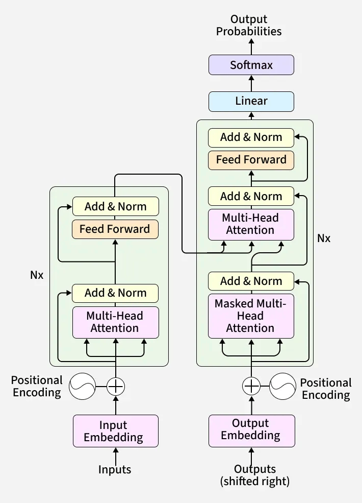

# Transformer From Scratch

This repository is a deep dive into the Transformer architecture introduced in the paper "Attention Is All You Need" (Vaswani et al., 2017)** using PyTorch.

## Transformer Architecture



*Figure: Encoder–decoder Transformer architecture from "Attention Is All You Need" (Vaswani et al., 2017).*

The goal of this project is to implement the complete encoder–decoder Transformer architecture from 
first principles using PyTorch, building each component step-by-step to develop a deep understanding 
of attention-based models.

Instead of using high-level libraries like HuggingFace, every component is implemented
step-by-step, including:

- tokenization and embeddings  
- scaled dot-product attention  
- multi-head attention  
- positional encoding  
- encoder blocks  
- decoder blocks with causal masking  
- encoder–decoder cross attention  
- full Transformer architecture  
- sequence-to-sequence training  

The repository is organized into stages so that each part of the Transformer can be
implemented, tested, and understood independently.

## Current Status

### Completed

- Stage 01 – Foundations  
- Stage 02 – Attention  
- Stage 03 – Multi-head Attention  
- Stage 04 – Positional Encoding  
- Stage 05 – Encoder  
- Stage 06 – Decoder  
- Stage 07 – Full Transformer  
- Stage 08 – Training Pipeline  
- Stage 09 – Debugging and Validation  
- Stage 10 – Analysis and Interpretability 

The full Transformer architecture has been implemented and validated with:

- correct causal masking in the decoder  
- correct padding masking in encoder and cross-attention  
- no future token leakage (strict causality enforcement)  
- mask application before softmax (no post-softmax masking)  
- stable attention computation (no NaNs, safe handling of fully masked rows)  
- verified encoder–decoder interaction  
- correct gradient flow through the entire model  


## Training

The model is trained on synthetic sequence-to-sequence tasks to isolate and study behavior:

- copy task (baseline behavior validation)  
- structured synthetic tasks (for controlled experimentation)  

Training setup includes:

- teacher forcing with proper target shifting  
- causal + padding mask composition  
- stable optimization (Adam with fixed learning rate)  


## Analysis and Interpretability (Stage 10)

This project goes beyond implementation and training by analyzing internal Transformer behavior.

Implemented analysis components:

- **Attention extraction** (layer-wise, head-wise)  
- **Entropy analysis** (attention sharpness and distribution)  
- **Head similarity analysis** (cosine similarity across heads)  
- **Positional behavior analysis** (diagonal patterns, attention shifts)  
- **Causal intervention (head ablation)** to measure true importance  

Key insights:

- **Attention weights alone do not indicate importance.**
- **Causal intervention (ablation) is required to measure functional contribution.**
- **Head behavior must be analyzed at both global and per-token levels to distinguish positional vs content-based roles.**


## Key Findings

- Attention head specialization does not emerge in simple or purely positional tasks (copy, reverse)  
- Content-based tasks induce specialization, primarily in early layers  
- Attention heads can be functionally categorized into:
  - identity (structural preservation)
  - content-based (dynamic retrieval)
  - diffuse (global mixing)  
- Identity heads act as critical structural bottlenecks with high per-head importance  
- Content heads perform distributed retrieval, but their importance is uneven across heads  
- Deeper layers exhibit diffuse and highly redundant behavior with low individual head importance  
- Head importance is asymmetric and must be evaluated using controlled causal ablation, not attention weights alone  


## Project Structure

The repository is organized into stages:

```
transformer-from-scratch/
│
├── assets/
├── experiments/
│
├── models/
│   └── transformer.py
│
├── stage01_foundations/
├── stage02_attention/
├── stage03_multihead/
├── stage04_positional_encoding/
├── stage05_encoder/
├── stage06_decoder/
├── stage07_full_transformer/
├── stage08_training/
│   ├── train.py
│   └── data_loader.py
│
├── stage09_debugging/
├── stage10_analysis/
│   ├── attention_utils.py
│   ├── attn_entropy.py
│   ├── head_similarity.py
│   ├── positional_analysis.py
│   ├── intervention.py
│   ├── synthetic_tasks.py
│   ├── run_analysis.py
│   └── run_stage10.py
│
├── utils/
│
├── .gitignore
├── requirements.txt
├── README.md
├── FINDINGS.md
├── LICENSE
│
├── checkpoint.pt   (should NOT be committed)
└── venv/           (local environment, ignored)

```


## Next Steps

- Validate findings across multiple random seeds for stronger statistical reliability  
- Test robustness under longer sequence lengths and increased task complexity  
- Extend analysis to larger models and higher head counts  
- Investigate interaction between attention heads and feedforward layers  
- Explore scaling behavior toward small language model (SLM) settings  


## Reference

Ashish Vaswani, Noam Shazeer, Niki Parmar, Jakob Uszkoreit,  
Llion Jones, Aidan N. Gomez, Lukasz Kaiser, and Illia Polosukhin.  

**Attention Is All You Need** (2017) - https://arxiv.org/abs/1706.03762

## License

This project is licensed under the **MIT License**.

You are free to use, modify, and distribute this code with proper attribution.

See the [LICENSE](LICENSE) file for details.
